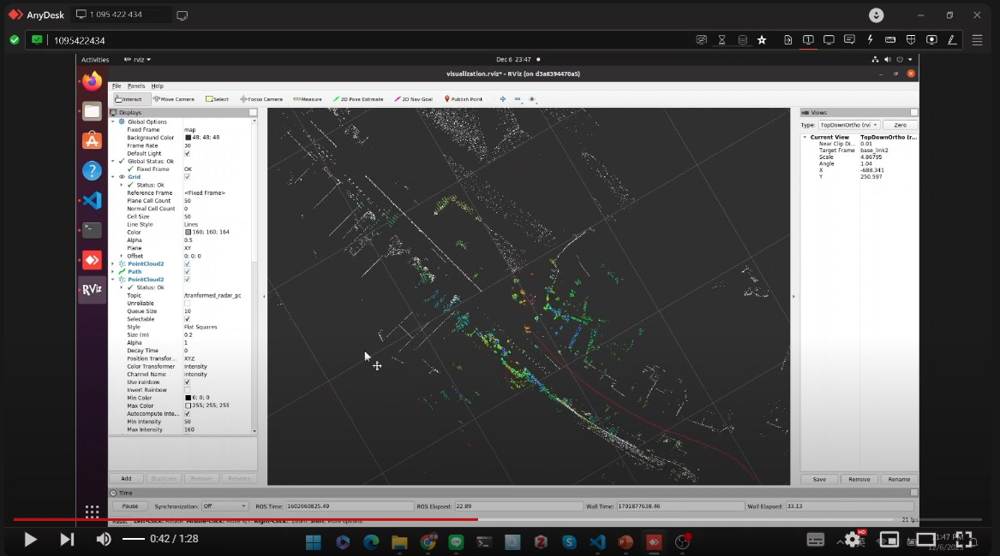

# SDC 2023 Midterm Competition - Radar Localization

Using Radar images to find where you are on a Lidar map.

## Vidoe Links

[](https://youtu.be/XW1q0txjLHg)

[](https://youtu.be/-MOApY6Xbu8)


## Prerequisite

1. Install Docker according to SDC Homework 1
2. Make sure ~/midterm_ws/src existing
3. Place /localization folder under ~/midterm_ws/src/

## Environment Setup

Create docker environment

```bash
xhost +local:
sudo docker run \
-it \
--env="DISPLAY" \
--env="QT_X11_NO_MITSHM=1" \
--volume="/tmp/.X11-unix:/tmp/.X11-unix:rw" \
-p 2233:22 \
--rm \
--name ros \
--user root \
-e GRANT_SUDO=yes \
-v ~/midterm_ws:/root/catkin_ws \
softmac/sdc-course-docker:latest \
bash
```
<!-- 
```bash
sudo docker exec -it ros bash
``` -->

## Localization

```bash
cd ~/catkin_ws
catkin_make
source devel/setup.bash
roslaunch localization localization.launch
```

## Visualization

```bash
cd ~/catkin_ws
catkin_make
source devel/setup.bash
roslaunch localization visualization.launch
```

## Map Modification

```bash
cd ~/catkin_ws
catkin_make
source devel/setup.bash
roslaunch localization map_modified.launch
```